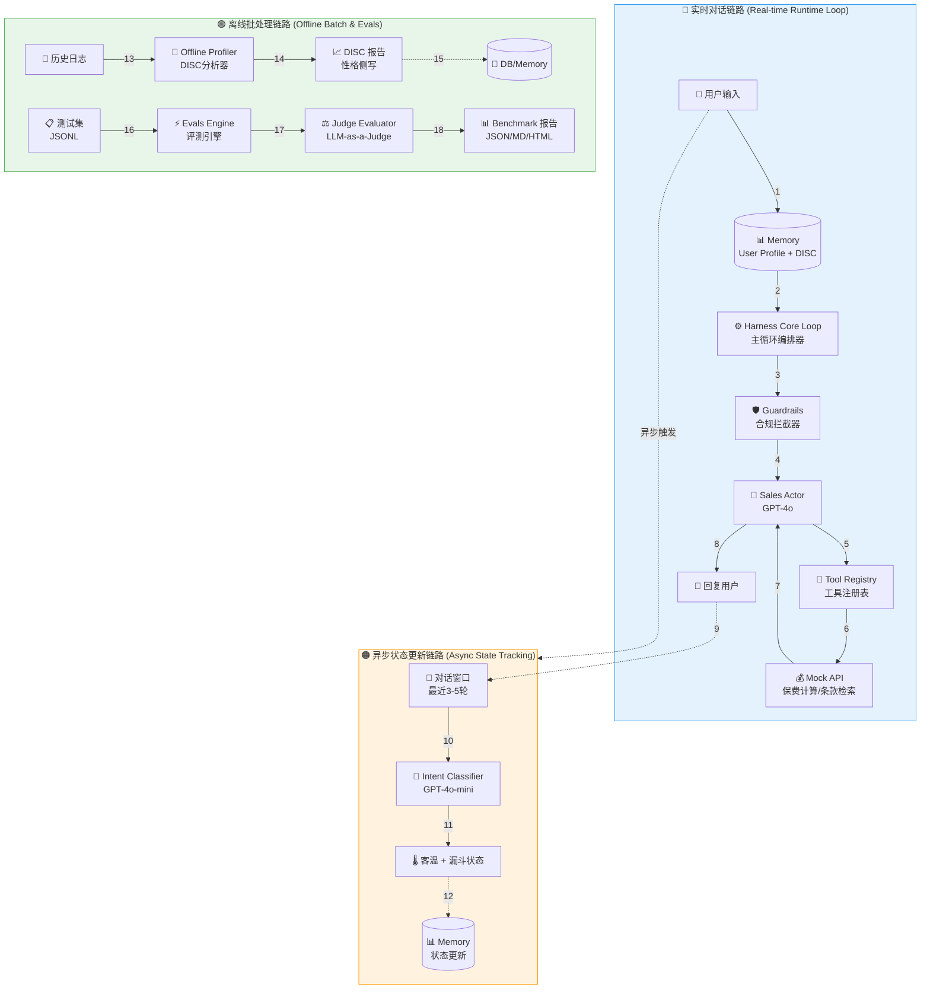
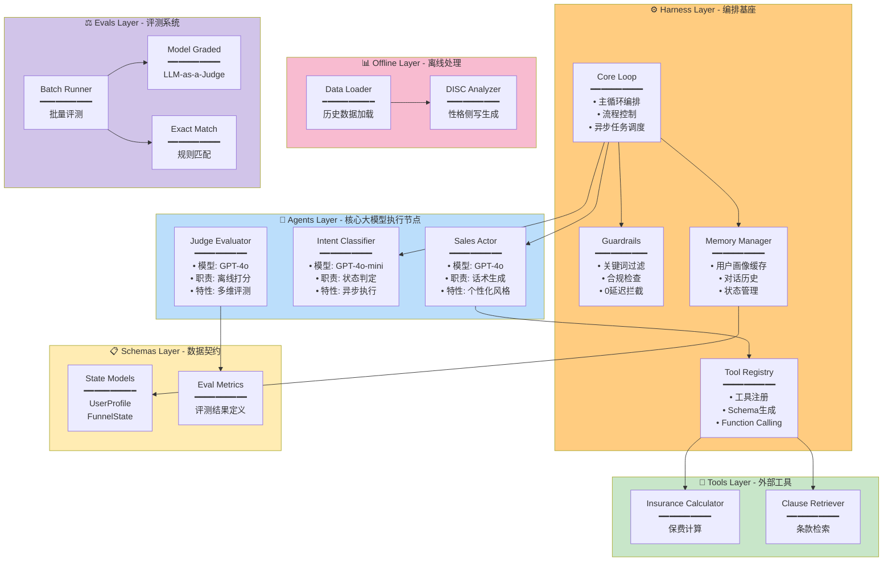
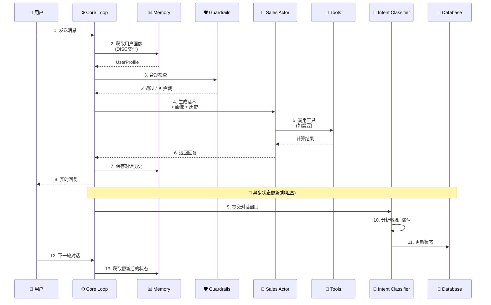
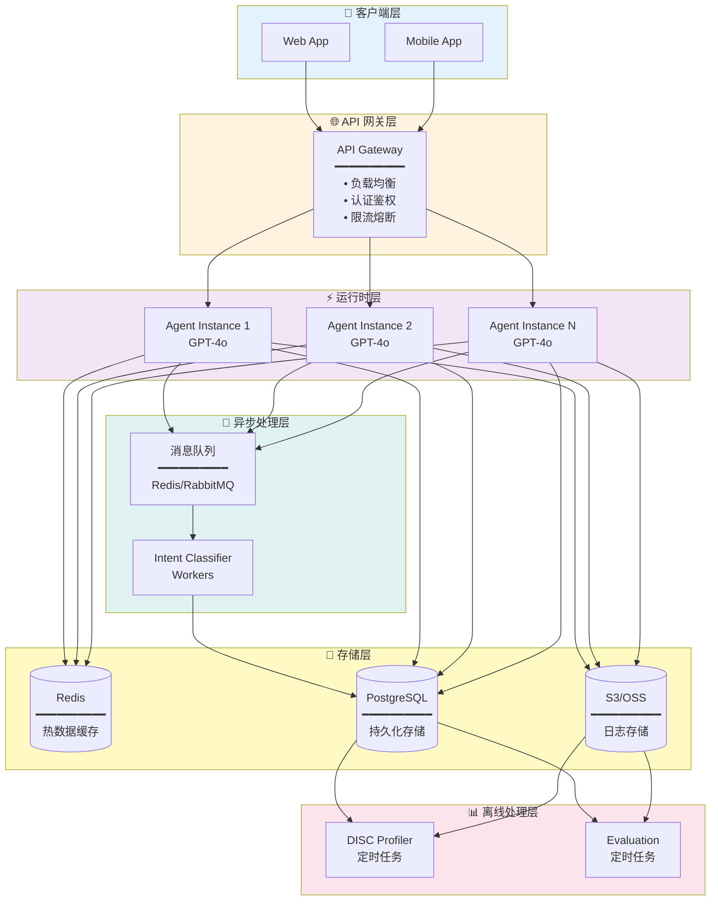
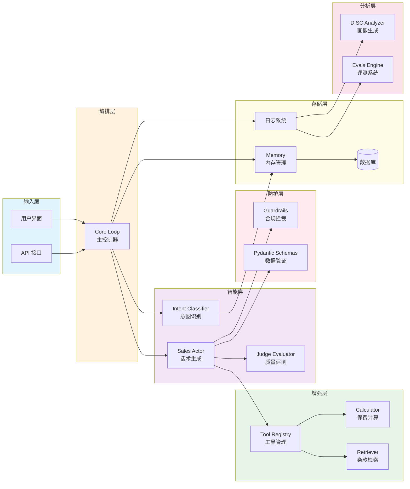
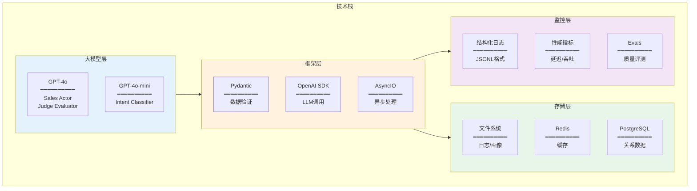
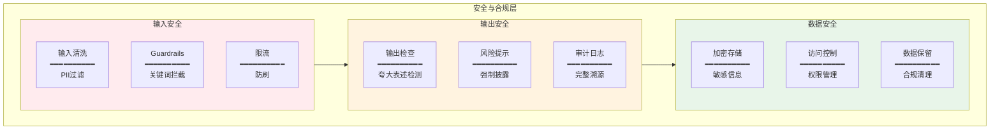

# Insurance Agent Harness - 技术架构图

## 1. 系统全景架构图

## 2. 模块详细架构图

## 3. 数据流转时序图

## 4. 部署架构图

## 5. 核心组件关系图

## 6. 技术栈架构图

## 7. 安全与合规架构

---

## 架构设计亮点

### 🎯 三层解耦
- **实时层**：零延迟响应，用户体验优先
- **异步层**：后台分析，不阻塞主流程
- **离线层**：深度分析，持续优化

### 🛡️ 防幻觉设计
- **Pydantic 强类型**：所有数据结构严格定义
- **双模式评测**：规则 + LLM 双重保障
- **完整审计**：每次交互可溯源

### ⚡ 高性能
- **轻量级 Guardrails**：Regex 实现零延迟
- **异步状态更新**：后台任务不阻塞
- **智能缓存**：减少重复计算

### 🔧 可扩展
- **模块化设计**：组件独立，易于替换
- **工具注册表**：轻松集成新工具
- **评测框架**：支持自定义维度
