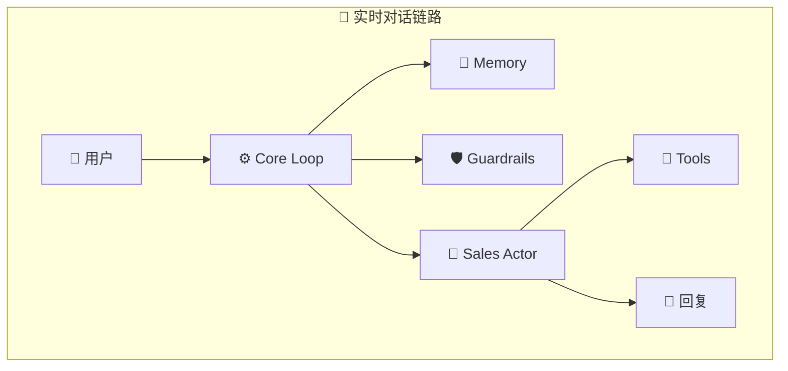

# Insurance Agent Harness - 系统架构图

本项目提供多个视角的技术架构图，全面展示保险 Agent 系统的设计。

## 📊 架构图列表

### 1. 主系统架构图
**文件**: `system_architecture.mermaid`

展示完整的三条数据流转链路：
- 🔵 **实时对话链路**：用户输入 → Memory → Guardrails → Sales Actor → Tools → 回复
- 🟠 **异步状态更新链路**：对话窗口 → Intent Classifier → 状态更新 → Memory
- 🟢 **离线批处理链路**：历史日志 → DISC Analyzer → 评测系统 → Benchmark 报告



### 2. 数据流向时序图
**文件**: `data_flow_sequence.mermaid`

展示完整的交互时序和异步处理流程：
1. 实时对话：同步响应
2. 异步状态更新：非阻塞后台执行
3. 离线批处理：定期任务
4. 离线评测：周期性执行

### 3. 分层架构图
**文件**: `layered_architecture.mermaid`

展示系统的 7 层架构：
- 📱 **表现层**：Web UI / API
- ⚙️ **编排层**：Core Loop / Memory
- 🤖 **智能层**：Sales Actor / Intent Classifier / Judge Evaluator
- 🛡️ **防护层**：Guardrails / Pydantic Schemas
- 🔧 **增强层**：Tool Registry / Calculator / Retriever
- 📊 **分析层**：DISC Profiler / Evals Engine
- 💾 **存储层**：Redis / PostgreSQL / File System

### 4. 完整架构文档
**文件**: `ARCHITECTURE.md`

包含：
- 系统全景架构图
- 模块详细架构图
- 数据流转时序图
- 部署架构图
- 核心组件关系图
- 技术栈架构图
- 安全与合规架构

## 🎨 核心设计理念

### 三条独立但交织的数据链路

| 链路 | 颜色 | 同步性 | 耗时 | 优先级 |
|------|------|--------|------|--------|
| 实时对话 | 🔵 蓝色 | 同步 | <1s | 最高 |
| 异步状态 | 🟠 橙色 | 异步 | 后台 | 中 |
| 离线批处理 | 🟢 绿色 | 定时 | 长时间 | 低 |

### 防幻觉设计

- **Pydantic 强类型**：所有数据结构严格定义
- **双模式评测**：规则匹配 + LLM-as-a-Judge
- **完整审计日志**：JSONL 格式，可溯源

### 高性能架构

- **零延迟 Guardrails**：Regex 规则引擎
- **异步状态更新**：不阻塞主流程
- **智能缓存**：Memory Manager 缓存热数据

## 📖 如何查看架构图

### 在线查看（推荐）
访问 [Mermaid Live Editor](https://mermaid.live)，将 `.mermaid` 文件内容粘贴即可查看。

### 在 VSCode 中查看
1. 安装插件：`Markdown Preview Mermaid Support`
2. 打开 `ARCHITECTURE.md` 文件
3. 切换到预览视图

### 在 GitHub 中查看
直接在 GitHub 上查看 `ARCHITECTURE.md` 文件，GitHub 原生支持 Mermaid 渲染。

### 导出为图片
```bash
# 使用 mermaid-cli
npm install -g @mermaid-js/mermaid-cli
mmdc -i system_architecture.mermaid -o architecture.png
```

## 🚀 快速开始

```bash
# 查看架构图
cat ARCHITECTURE.md

# 运行演示
python3 demo_mode.py

# 运行测试
python3 test_tools.py
```

## 📂 项目结构

```
insurance-agent-harness/
├── system_architecture.mermaid      # 主系统架构图
├── data_flow_sequence.mermaid       # 数据流向时序图
├── layered_architecture.mermaid     # 分层架构图
├── ARCHITECTURE.md                  # 完整架构文档
├── ARCHITECTURE_DIAGRAMS.md         # 本文件
├── agents/                          # 智能体层
├── harness/                         # 编排层
├── offline_profiler/                # 分析层
├── evals/                           # 评测层
└── schemas/                         # 数据契约层
```

## 🎯 架构亮点

### 1. 解耦设计
- 实时、异步、离线三链路清晰分离
- 组件间通过标准接口通信
- 易于扩展和维护

### 2. 性能优化
- 关键路径零延迟
- 异步任务不阻塞
- 智能缓存减少重复计算

### 3. 可靠性保障
- 完整的审计日志
- 多层合规检查
- 防幻觉数据验证

### 4. 可观测性
- 结构化日志输出
- 性能指标监控
- 自动化评测报告

---

**面向 OpenAI CTO 的设计展示** 🎖️

本系统展示了：
- ✅ 清晰的架构分层
- ✅ 合理的异步设计
- ✅ 完善的防幻觉机制
- ✅ 生产级的评测体系
- ✅ 完整的可追溯性
