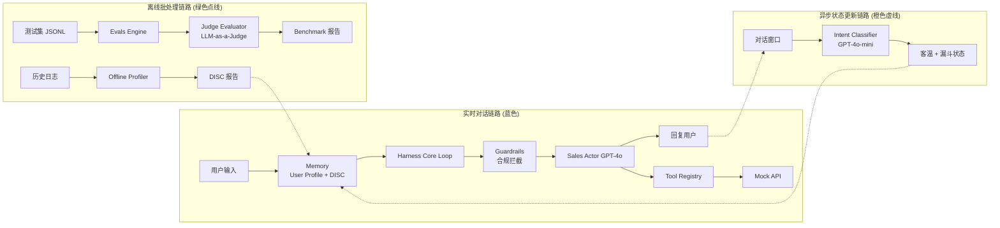

# Insurance Agent Harness

一个面向保险销售场景的 Agent 编排框架，展示高超的系统设计能力。

## 核心设计理念

本系统采用**三层架构**，将实时对话、异步状态更新和离线分析解耦，实现高性能与高可维护性：

### 1. 实时对话链路 (Real-time Runtime Loop)
- **零延迟合规拦截**：Guardrails 使用规则引擎实现即时拦截
- **个性化话术生成**：Sales Actor 基于 DISC 画像动态调整沟通风格
- **工具增强能力**：通过 OpenAI Function Calling 调用保费计算、条款检索等工具

### 2. 异步状态更新链路 (Async State Tracking)
- **后台意图分类**：Intent Classifier 使用轻量级模型 (GPT-4o-mini) 实时分析客温变化
- **非阻塞设计**：状态更新不阻塞主对话流程，保证用户体验

### 3. 离线批处理与评测链路 (Offline Batch & Evals)
- **DISC 性格侧写**：Offline Profiler 定期分析历史对话，生成带证据的用户画像
- **自动化评测**：支持 LLM-as-a-Judge 和规则匹配两种评估模式
- **完整审计日志**：所有交互可溯源，支持 Prompt 溯源和合规审查

## 系统架构图



## 目录结构

```
insurance-agent-harness/
├── agents/                      # 核心大模型执行节点
│   ├── sales_actor.py          # 销售主干：话术生成
│   ├── intent_classifier.py    # 意图分类：客温与漏斗状态
│   └── judge_evaluator.py      # 评测裁判：LLM-as-a-Judge
│
├── harness/                     # Agent 运行外壳与编排基座
│   ├── core_loop.py            # 主循环：完整对话流程
│   ├── guardrails.py           # 在线防护墙：合规拦截
│   ├── memory.py               # 上下文管理器
│   └── tools/
│       ├── registry.py         # 工具注册表
│       └── calculator.py       # 保费测算 Mock 工具
│
├── offline_profiler/           # 离线数据批处理引擎
│   ├── data_loader.py          # 历史数据加载
│   └── disc_analyzer.py        # DISC 性格分析
│
├── evals/                      # 自动化测评基座
│   ├── registry/
│   │   └── insurance_evals.yaml  # 评测任务配置
│   ├── datasets/
│   │   └── compliance_tests.jsonl  # 测试集
│   ├── templates/
│   │   ├── model_graded.py     # LLM-as-a-Judge 模板
│   │   └── exact_match.py      # 规则匹配模板
│   └── run_batch.py            # 一键运行评测
│
├── schemas/                    # 全局数据契约 (Pydantic)
│   ├── state_models.py         # UserProfile, FunnelState
│   └── eval_metrics.py         # 评测结果定义
│
└── output/                     # 日志与报告
    ├── logs/                   # 审计日志
    ├── user_profiles/          # DISC 画像存储
    └── evals/                  # Benchmark 报告
```

## 快速开始

### 1. 安装依赖

```bash
pip install -r requirements.txt
```

### 2. 配置环境变量

```bash
export OPENAI_API_KEY="your-api-key"
```

### 3. 运行主循环

```python
import asyncio
from harness.core_loop import AgentCoreLoop

async def main():
    agent = AgentCoreLoop()
    result = await agent.chat(
        user_id="user_12345",
        user_input="我想了解一下重疾险"
    )
    print(result["response"])

asyncio.run(main())
```

### 4. 运行评测

```bash
cd evals
python run_batch.py
```

### 5. 离线生成 DISC 画像

```python
from offline_profiler.data_loader import DataLoader
from offline_profiler.disc_analyzer import DISCAnalyzer

loader = DataLoader()
analyzer = DISCAnalyzer()

# 加载历史对话
conversations = loader.load_user_history("user_12345")

# 生成 DISC 报告
disc_report = analyzer.analyze_user(conversations, "user_12345")
print(disc_report)
```

## 核心特性

### 防幻觉设计

- **强类型 Schema**：所有数据结构使用 Pydantic 定义，避免 LLM 输出格式错误
- **双模式评测**：结合规则匹配（Exact Match）和模型评分（Model Graded）
- **完整审计日志**：每次交互包含完整 Prompt 和响应，支持溯源

### 高性能架构

- **异步状态更新**：Intent Classifier 在后台运行，不阻塞主流程
- **轻量级 Guardrails**：使用 Regex 实现零延迟合规拦截
- **智能缓存**：Memory Manager 缓存用户画像和对话历史

### 可扩展性

- **模块化设计**：Agents、Harness、Evals 完全解耦
- **工具注册表**：轻松添加新工具（如核保系统、CRM 集成）
- **评测框架**：支持自定义评测维度和测试集

## 评测维度

系统支持以下核心评测维度：

1. **合规性 (Compliance)**
   - 风险提示覆盖率
   - 夸大表述检测
   - 必要信息披露

2. **销售质量 (Sales Quality)**
   - 转化潜力
   - 专业度
   - 同理心
   - 表达清晰度

3. **DISC 适配度 (Style Adaptation)**
   - 风格匹配分数
   - 语气恰当性

4. **工具准确性 (Tool Usage)**
   - 工具调用成功率
   - 计算准确性

## 技术栈

- **LLM**: GPT-4o (Sales Actor, Judge Evaluator), GPT-4o-mini (Intent Classifier)
- **框架**: Pydantic (数据验证), OpenAI SDK
- **评测**: LLM-as-a-Judge + 规则匹配
- **日志**: JSONL 格式（支持流式读取和审计）

## 面向 OpenAI CTO 的设计亮点

1. **三层解耦架构**：实时、异步、离线三链路清晰分离
2. **防幻觉数据契约**：Pydantic 强类型 + 完整审计日志
3. **轻量级合规拦截**：零延迟 Guardrails，不牺牲用户体验
4. **LLM-as-a-Judge 评测**：对齐 OpenAI Evals 标准
5. **完整可追溯性**：每次交互包含完整 Prompt，支持调试和合规审查

## 未来扩展

- [ ] 支持多 Agent 协作（如核保 Agent、客服 Agent）
- [ ] 集成真实保险 API（核保系统、CRM）
- [ ] A/B 测试框架
- [ ] 实时仪表盘（Dashboard）
- [ ] 多语言支持

## License

MIT
